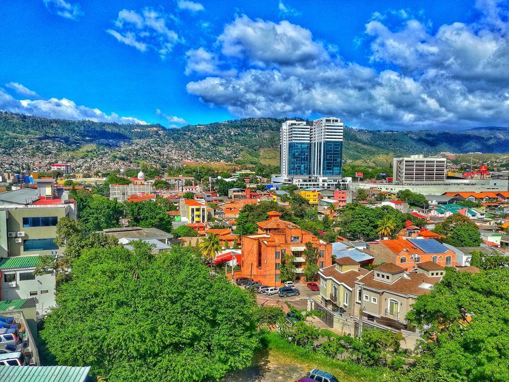
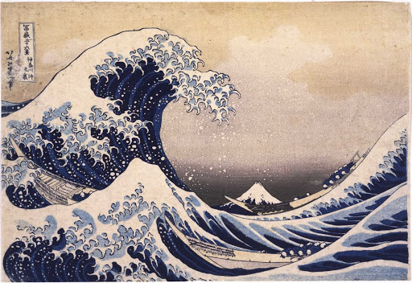
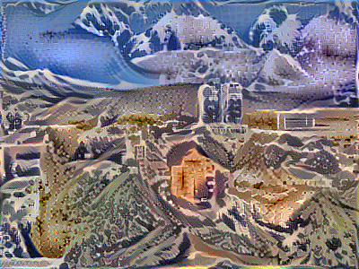
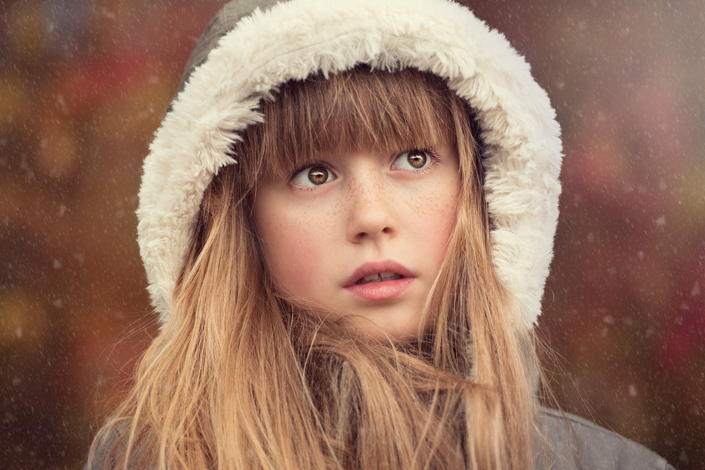
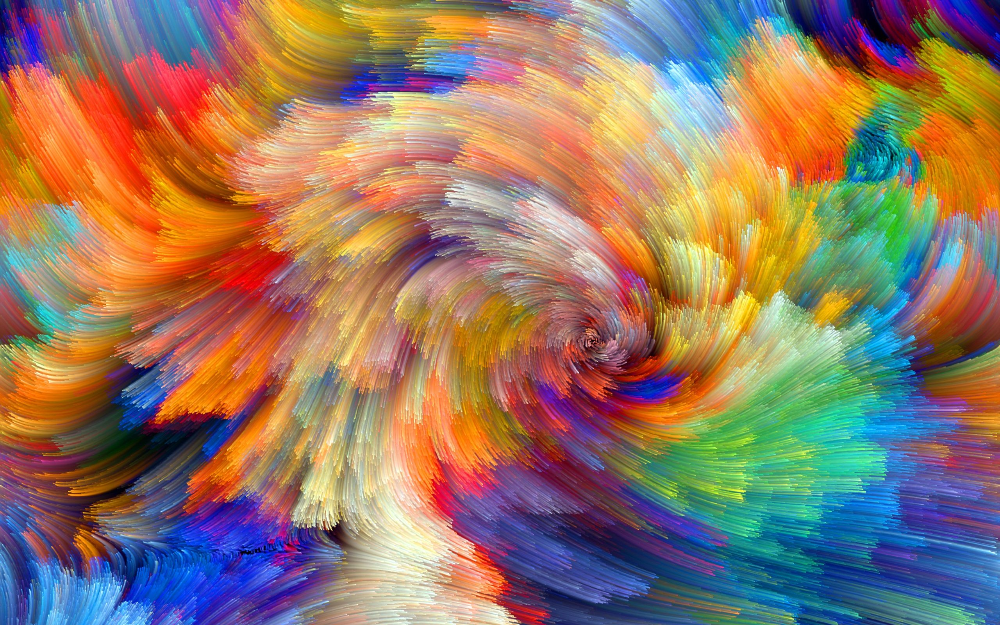
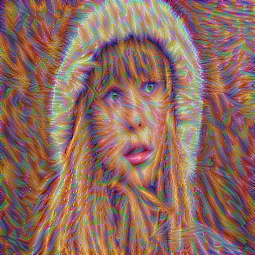

# Style Transfer Using Deep Learning

Please download the pretrained model from here: [VGG-19](http://www.vlfeat.org/matconvnet/models/imagenet-vgg-verydeep-19.mat)

More documentation, more examples, more functionality and better code soon (GPU is coming!)

### Example Content Image

### Example Style Image

### Generated Image (after 200 epochs)

### Example Content Image

### Example Style Image

### Generated Image (after 150 epochs)

Thanks to **Andrew Ng** and **Coursera**
*#deeplearniNg*
